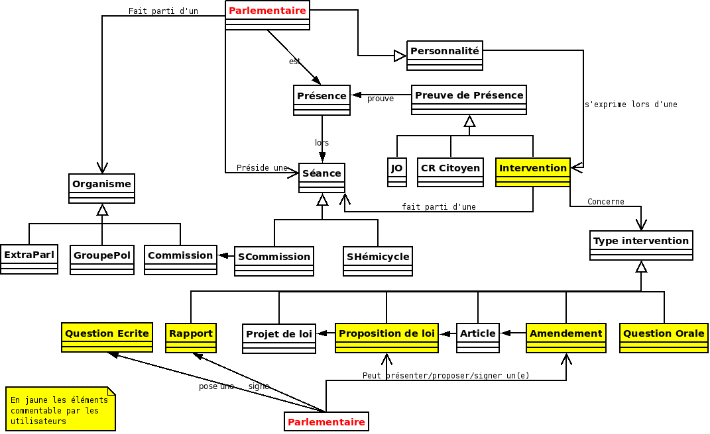

# Schéma SQL de NosDéputés.fr et NosSénateurs.fr

Schéma simplifié des bases de données :

Le projet exploite à l'heure actuelle une trentaine de tables :

- `alerte` : table contenant tous les abonnements à des alertes mails
- `alinea` : alinéas qui constituent projet de loi
- `amendement` : les amendemdent
- `article` : contenu éditorial de la plateforme
- `article_loi` : les articles d'un projet de loi
- `article_version` : version des contenus éditoriaux
- `citoyen` : les utilisateurs de la plateforme
- `commentaire` : les commentaires
- `commentaire_object` : lien entre un commentaire et un objet commentable
- `intervention` : les interventions des parlementaires
- `object_commentable` : une abstraction des objets commentable (héritage)
- `object_rated` : une abstraction des objets ratables
- `organisme` : les organismes parlementraires (ou extra) : groupes, commissions, ...
- `parlementaire` : les parlementaires
- `parlementaire_amendement` : liens entre parlementaires et amendmenets
- `parlementaire_organisme` : liens entre parlementaires et organismes
- `parlementaire_photo` : photos des parlementaires
- `parlementaire_texteloi` : liens entre parlementaire et un projet de loi
- `personnalite` : personnes auditionnées en commission ou s'étant exprimée au sein du parlement n'étant pas un parlementaire de cette chambre (ministre, personnalité qualifiée, ...)
- `presence` : présence des parlementaires
- `preuve_presence` : lien entre une présence et un document attestant de cette présence
- `question_ecrite` : questions écrites
- `rate` : note attribuée à un utilisateur sur un contenu ratable
- `seance` : séances publiques (hémicycle ou commission)
- `section` : section d'un projet de loi
- `tag` : mot clé
- `tagging` : association entre mot clé et interventions
- `texteloi` : documents parlementaires : projet de loi / rapports / ...
- `titre_loi` : projet de loi mis en discussion sur simplifions
- `variable_globale` : variables de configurations ou stockage (tops, ...)

